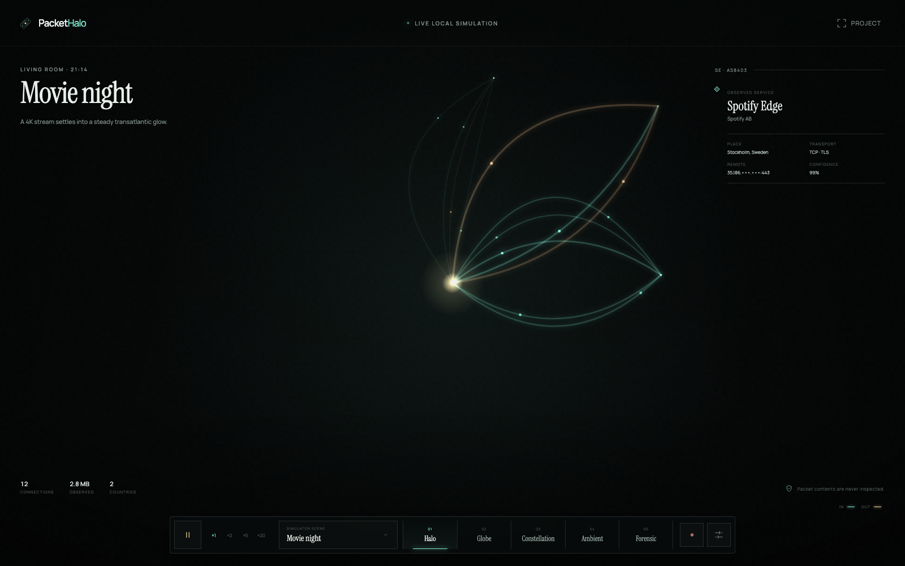
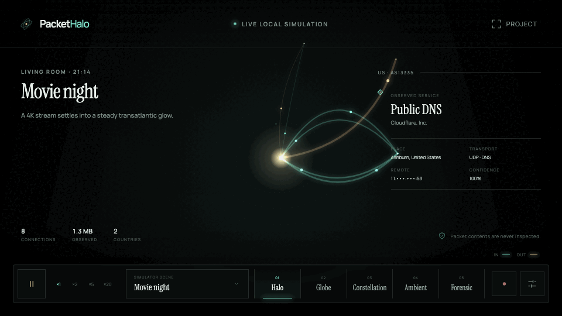
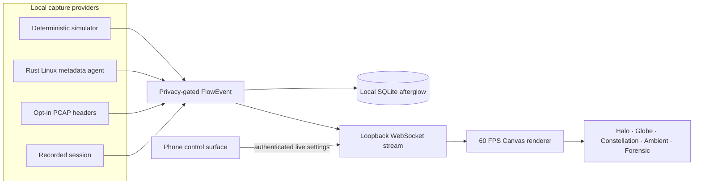

<div align="center">
  
  <h1>PacketHalo</h1>
  <p><strong>See where your home is speaking.</strong></p>
  <p>An ambient, real-time visualization that turns invisible Internet traffic into living light.</p>
  <p>
    <a href="#five-minute-start">Quick start</a> ·
    <a href="docs/simulator.md">Simulator</a> ·
    <a href="docs/privacy.md">Privacy</a> ·
    <a href="docs/architecture.md">Architecture</a> ·
    <a href="CONTRIBUTING.md">Contribute</a>
  </p>
  <p>
    
    
    
    
  </p>
</div>



<div align="center">
  
</div>

> Packet contents are never inspected.

PacketHalo is an observatory for the network around you. Home sits at the center. Devices move in quiet orbit. Connections bloom into curved light, remote networks pulse at the edge, and the recent past fades instead of vanishing. It is designed to live on a wall before it is designed to answer a troubleshooting question.

No account. No telemetry. No analytics. No cloud dependency. The first run uses a deterministic simulator, so the complete visual experience works before any capture provider is enabled.

## Five-minute start

You need Node.js 22+ and pnpm 10+.

```bash
pnpm install
pnpm dev
```

Open:

- **Observatory:** http://127.0.0.1:5173
- **Phone control surface:** http://127.0.0.1:5174
- **Local event server:** http://127.0.0.1:8787/health

The Movie Night scene begins automatically. Press <kbd>Space</kbd> to pause, <kbd>M</kbd> to move through visual modes, <kbd>C</kbd> to clear the instruments, and <kbd>F</kbd> to project fullscreen.

Prefer containers?

```bash
docker compose up
```

Then open http://127.0.0.1:8080. All published Docker ports are host-loopback only.

## Five ways to see the same invisible world

| Mode              | Character                      | What emerges                                     |
| ----------------- | ------------------------------ | ------------------------------------------------ |
| **Halo**          | The signature living sculpture | Devices, luminous arcs, intensity and afterglow  |
| **Globe**         | A slowly turning world         | Geography, transfer weight and arc altitude      |
| **Constellation** | Services as stars              | Repetition, brightness and natural clusters      |
| **Ambient**       | Almost silent                  | Projector-safe movement with nearly no text      |
| **Forensic**      | An instrument, not a table     | Ports, ASNs, countries, protocols and confidence |

Nine coordinated palettes include OLED, projector and high-contrast themes. Every movement can be reduced; every primary control is keyboard reachable.

## A simulator worth leaving on

Twenty-four built-in scenes cover movie night, a dedicated Netflix premiere, calls, gaming, large downloads, developer workflows, IoT, public Wi-Fi and a suspiciously regular beacon. Each scene supports:

- pause and resume;
- ×0.25 slow motion, ×1, ×2, ×5 and ×20 time;
- recording, replay and scrubbing;
- explicit random seeds;
- repeatable metadata output.

The simulator is not sample decoration. It uses the same `FlowEvent` contract and renderer path as capture providers. See [scenario semantics and replay](docs/simulator.md).

## Privacy is an architectural property

PacketHalo's event model contains connection metadata: endpoints, ports, transport, process when the operating system exposes it, byte and packet counts when a provider can measure them, geography, ASN, timestamps and an uncertainty-aware classification.

It has no field for—and the server rejects objects containing—payloads, request or response bodies, cookies, passwords, tokens, pages, email content, or chat messages. CI checks both TypeScript and Rust contracts on every change.

```text
permitted:  142.250.18.34 · QUIC/443 · AS15169 · 842 KB · browser · 92%
impossible: GET /private-page · Cookie: … · message text · response body
```

Read the [privacy promise](docs/privacy.md) and [security model](docs/security-model.md) before enabling a real provider.

## Architecture at a glance



| Area                      | Purpose                                                     |
| ------------------------- | ----------------------------------------------------------- |
| `apps/web`                | React observatory and accessible instrument console         |
| `apps/control`            | Responsive phone controller with live WebSocket settings    |
| `apps/server`             | Authenticated event stream, retention and provider registry |
| `apps/simulator`          | Headless scenario source for integration and Docker         |
| `agent/rust-agent`        | Tokio-based Linux socket metadata provider                  |
| `packages/protocol`       | Payload-incapable cross-runtime event contract              |
| `packages/simulator-core` | Seeded scenario engine, recording and playback              |
| `packages/renderer`       | Canvas modes, palettes, interpolation and frame metrics     |
| `packages/geo`            | Offline-first location provider interface                   |

The deeper walkthrough explains [data flow, trust boundaries and package decisions](docs/architecture.md).

## Real Linux metadata

The first real provider reads `/proc/net/tcp*` and `/proc/net/udp*`. It observes the operating system's socket table, optionally resolves process names from `/proc/<pid>/fd`, and never opens a packet capture device.

```bash
cargo run --release --manifest-path agent/rust-agent/Cargo.toml
```

Unknown bytes, geography, ASN and organization remain zero or `Unknown`; PacketHalo does not invent precision. See [how capture works](docs/capture.md).

## Verification

```bash
pnpm verify          # lint, types, unit tests, privacy, builds, Rust tests + Clippy
pnpm test:e2e        # desktop and phone interaction tests
pnpm measure:renderer # headed 1080p / 2,000-flow performance evidence
```

The test surface includes protocol privacy checks, seeded simulator repeatability, renderer layout tests, server authentication defaults, offline geo behavior, Rust `/proc` parsing, Playwright interactions and live renderer health readouts. CI also publishes the built observatory as a documentation preview artifact.

## Raspberry Pi / projector appliance

The appliance profile boots Docker services automatically and launches Chromium fullscreen. Projection rotation is live, the phone controller works over authenticated LAN mode, and no keyboard is needed after setup.

Start with the [Raspberry Pi appliance guide](appliance/README.md).

## Documentation

- [Architecture](docs/architecture.md)
- [Simulator and recordings](docs/simulator.md)
- [Privacy promise](docs/privacy.md)
- [Security model](docs/security-model.md)
- [Capture providers](docs/capture.md)
- [Rendering system](docs/rendering.md)
- [Plugin system](docs/plugins.md)
- [Performance](docs/performance.md)
- [Troubleshooting](docs/troubleshooting.md)
- [Roadmap](docs/roadmap.md)
- [FAQ](docs/faq.md)

## License

PacketHalo is open source under the [MIT License](LICENSE).
